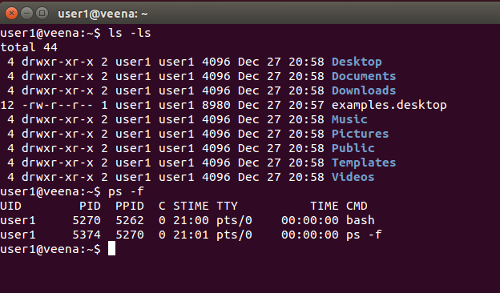

# Iniciando mi Linux

Al instalar Linux en tu PC por primera vez y ver que todo funciona correctamente, es tentador pensar que lo más difícil ya ha pasado. Sin embargo, con el tiempo, te das cuenta de la abrumadora cantidad de posibilidades que ofrece este sistema operativo. Pero no te preocupes, vamos paso a paso.

## "¡La terminal es lo importante!" exclaman los usuarios de Linux

Cuando un usuario de Linux te habla sobre la terminal y las ventajas de usarla, realmente está hablando de Bash. 

Bash, que significa Bourne Again Shell, es una shell de Unix y un intérprete de comandos que se utiliza principalmente en sistemas operativos Unix y Unix-like, como Linux y macOS. Es una evolución de la shell original de Unix, la Bourne Shell (sh), diseñada por Stephen Bourne.

Una shell es un programa informático que actúa como una interfaz entre el usuario y el núcleo (kernel) de un sistema operativo. Proporciona una forma de interactuar con el sistema operativo mediante la ejecución de comandos ingresados por el usuario.

De primeras vamos a ver la terminal con un aspecto parecido a este:



Algunos ejemplos de shells populares incluyen:

- _Bash_ (Bourne Again Shell): Es la shell predeterminada en la mayoría de las distribuciones de Linux y es una evolución de la shell Bourne original (sh).
- _Zsh_ (Z Shell): Es una shell alternativa con características adicionales, como una mejor finalización de pestañas (tab completion) y temas personalizables.
- _Fish_ (Friendly Interactive Shell): Es una shell diseñada para ser fácil de usar y con características amigables para el usuario, como sugerencias de comandos y resaltado de sintaxis.
- _PowerShell_: Es una shell desarrollada por Microsoft, principalmente para sistemas Windows, pero también disponible para sistemas Unix-like a través de PowerShell Core. Ofrece potentes capacidades de scripting y automatización.

### ¿Qué ventajas tenemos en una Bash?

La shell Bash (Bourne Again Shell) es una de las opciones más populares y poderosas disponibles en sistemas Unix y Unix-like, como Linux. Algunas de las ventajas de usar Bash incluyen:

1. Flexibilidad: Bash es altamente personalizable y ofrece una amplia gama de características para adaptarse a las necesidades del usuario.
2. Potencia: Es capaz de ejecutar scripts y automatizar tareas, lo que la convierte en una herramienta poderosa para la administración del sistema y la programación de scripts.
3. Interactividad: Proporciona una interfaz interactiva que permite al usuario interactuar directamente con el sistema operativo de forma eficiente.
4. Amplio soporte: Bash está ampliamente adoptado en sistemas Unix y Unix-like, lo que significa que hay una gran cantidad de recursos disponibles en línea, desde documentación oficial hasta tutoriales y ejemplos de scripts.
5. Compatibilidad: Bash es compatible con scripts escritos para shells Bourne (sh) y C (csh), lo que facilita la migración de scripts entre diferentes sistemas Unix.
6. Historial de comandos: Bash mantiene un historial de comandos ejecutados, lo que facilita la recuperación y repetición de comandos anteriores.
7. Expansión de comandos: Ofrece diversas funcionalidades de expansión de comandos, como expansión de variables, expansión de comodines y expansión aritmética, que aumentan la productividad del usuario.

Bueno, como podemos ver, toda esta lista suena maravillosa, pero... ¿Por donde empiezo? 

## Bash

En este apartado vamos a ver algunas curiosidades y funciones utiles que podemos utilizar en una Bash.

### Autocompletado con Tab

En Bash, la tecla de tabulación (tab) tiene una función muy útil conocida como "completado de pestañas" o "tab completion". Esta función ayuda al usuario a completar comandos, nombres de archivos, directorios y variables de manera rápida y eficiente.

Cuando el usuario escribe una parte de un comando, nombre de archivo, directorio o variable, puede presionar la tecla de tabulación y Bash intentará completar automáticamente lo que el usuario ha escrito hasta ese momento. Si hay múltiples opciones de completado, Bash mostrará las opciones posibles, lo que permite al usuario seleccionar la opción deseada o continuar escribiendo para refinar la búsqueda.

Por defecto, el _tab completion_ es case insensitive (sensible a mayusculas/minusculas). Esto quiere decir que, por ejemplo, si estamos en el directorio home y queremos ir al directorio Descargas, un:

```bash
cd des (apretar Tab)
```

No completaria a:

```bash
cd Descargas
```

Ya que esta buscando un directorio que comience con "d" minuscula. 

¿Y esto se puede cambiar? 

Bueno, la respuesta simple es si. Pero, hay que hacer algunas modificaciones al archivo .bashrc para que sea case sensitive.

¿No hay algo más facil y para todos los que empezamos?

Si, y de hecho, podemos mejorar drasticamente la funcionalidad, la apariencia y el manejo de repositorios con git cambiando la Shell a Zsh, sin perder ninguna de las ventajas que tenemos con bash.

## Zsh

Zsh, que significa Z Shell, es una shell de Unix y un intérprete de comandos que se utiliza como una alternativa avanzada a la shell Bourne (sh) en sistemas operativos Unix y Unix-like, como Linux y macOS. Zsh es conocida por sus numerosas características adicionales y su capacidad para mejorar la productividad y la experiencia del usuario en comparación con otras shells como Bash.

### Instalación

¡Exelente! Entonces ¿Cómo lo instalamos?

Primero vamos a instalar la shell (para distros basadas en Debian):

```bash
sudo apt install zsh -y
```

Una vez instalada, debemos indicarle a nuestro Linux, que ya no queremos usar Bash, sino Zsh:

```bash
chsh -s $(which zsh)
```

Con esto ya tendriamos la Zsh totalmente operativa en la proxima terminal que abramos. Entonces, vamos a cerrar la terminal actual y vamos a abrir una nueva, donde notaremos un cambio en el prompt.

El "prompt" (o "indicador de comando" en español) en el contexto de una shell como Bash o Zsh, es el texto o símbolo que se muestra en la línea de comandos para indicar que la shell está lista para recibir la entrada del usuario.

En este caso el prompt de bash tiene el siguiente formato:

```bash
# En bash
[user@host] directory$
```

Y el de Zsh será parecido, por ahora, pero vamos a cambiarlo para que se vea más bonito con OhMyZsh.

Para instalar OhMyZsh primero debemos asegurarnos de tener "curl" instalado, que es un programa que nos permitirá descargar el recurso. Aplicando el siguiente comando, verificaremos si "curl" está instalado, y si no lo esta, lo instalará. Luego automaticamente, descargará e instalará OhMyZsh.

```bash
sudo apt install curl
sh -c "$(curl -fsSL https://raw.githubusercontent.com/ohmyzsh/ohmyzsh/master/tools/install.sh)"
```

Con esto, nuestro nuevo prompt no solo debería tener colores, sino que debería tener un aspecto como este:

```bash
➜  ~
```

Este aspecto es porque, por defecto, el tema aplicado es robbyrussell. Si no te gusta este tema, puedes buscar el nombre del tema que te guste [aquí](https://github.com/ohmyzsh/ohmyzsh/wiki/Themes).

Una vez tienes el nombre del tema que te gusta, puedes elegir dos maneras de editar el archivo, la primera automática:

```bash
read theme_name; sed -i "s/^ZSH_THEME=\"[^\"]*\"/ZSH_THEME=\"$theme_name\"/" ~/.zshrc
```

Para ejecutar este comando, vamos a copiarlo y pegarlo en la terminal y apretar enter. Luego, vamos a escribir textual el nombre del tema que nos ha gustado (hay que tener cuidado que no se inserten espacios adicionales al inicio o al final, ya que si esto sucede, el comando no funcionará) y una vez hemos terminado, podemos apretar enter y el tema se habrá reemplazado. Para poder notar los cambios debemos reiniciar la terminal.

Y en la segunda opción, manualmente editaremos el archivo .zshrc:

```bash
nano ~/.zshrc
```

Y buscaremos la linea que dice: 

```bash
ZSH_THEME="theme_name"
```

Donde *theme_name* es el nombre del tema actual (robbyrussell), y lo cambiaremos por el nombre del que más nos gustó en la página.

Una vez editado, podemos apretar `ctrl+o` para guardar, luego `enter` para escribir y por último `ctrl+x` para salir.

Con esto, una vez reiniciemos la terminal, veremos los cambios reflejados.

En caso de que este metodo te resulte complicado, tambien puedes realizarlo con vscode:

```bash
code ~/.zshrc
```

Y repites el procedimiento, pero en vscode (no hace falta tocar `ctrl+o` ni ningúno de los atajos de teclado anteriores, esos atajos de teclado funcionan en nano unicamente).

## Configuracion del GRUB

Aquellos que tienen configurado un Dual Boot entre Windows y Linux, es bastante tedioso tener que estar pendiente del encendido para que la PC, luego de unos pocos segundos, no bootee por defecto en Linux.

Esto, curiosamente es bastante sencillo de solucionar, pero debemos ir con cuidado. 

Para no complicar mucho las cosas he realizado un script que cambiará esto por nosotros, y tambien dejará un backup en caso de que algo salga mal. De igual manera, voy a enseñar la manera de hacerlo manualmente para que no queden dudas. 

Para ejecutar el script hay dos maneras de hacerlo:

1) Sin descargar el archivo (testeo):

```bash
sudo apt install curl -y && sudo curl -sSL https://raw.githubusercontent.com/EVAnci/Notas/main/linux/grub-time-changer.sh | bash
```

2) Descargando el archivo (recomendado):

```bash
sudo apt install wget -y && wget https://raw.githubusercontent.com/EVAnci/Notas/main/linux/grub-time-changer.sh
chmod 775 grub-time-changer.sh
sudo !$
```

En ambos casos estamos corriendo el script para cambiar el tiempo de espera en el GRUB, solo que en el primer caso, estamos usando la salida del comando curl para darlo como entrada a bash, de este modo se ejecutará el script, pero esto no puedo asegurar que funcione en todas las distros, ya que solo lo he probado en Debian. En cambio, en el caso 2, el script se descarga, se configuran manualmente los permisos de ejecucion para todos los usuarios, y por ultimo se lo ejecuta con permisos de super usuario, ya que debemos modificar cosas internas del sistema.

Una vez se ejecuta el script, nos genera un archivo de reespaldo, y luego nos pregunta por el tiempo que queremos que el GRUB esté esperando para que se lance una entrada de sistema operativo. Al momento de ingresar el tiempo, este debe estar en SEGUNDOS.

Si tienes ganas de aprender y arriesgarte un poco, entonces vamos a ver como configurar el timeout de GRUB de forma manual.

Primero que nada vamos a escalar nuestros privilegios para ser usuarios root:

```bash
sudo su
```

Este comando nos pedirá la contraseña, y luego nos cambiará el prompt por uno al estilo de bash plano. 

Para comenzar, vamos a crear un archivo de reespaldo del archivo de configuración de GRUB por si tenemos algún problema. 

```bash
cp /etc/default/grub /etc/default/grub.bkp
```

Luego vamos a editar el archivo grub original, donde editaremos una linea que dice "GRUB_TIMEOUT":

```bash
# GRUB boot loader configuration

GRUB_DEFAULT=0
GRUB_TIMEOUT=5  <----------- Esta linea 
GRUB_DISTRIBUTOR="Arch"

```

Para editarla usaremos un editor de texto por terminal llamando nano, ya que no es recomendable correr programas como VSCode en modo superusuario.

```bash
nano /etc/default/grub
```

Luego, dentro del editor, vamos a cambiar el tiempo por el que nosotros queramos, (recomiendo que sea entre 5 y 120 segundos), y una vez terminemos, vamos a tocar `ctrl+o` luego `enter` y por ultimo `ctrl+x`. Con esto ya nos queda el archivo modificado. Para confirmar los cambios podemos hacer un cat al archivo y verificar que la line de timeout este en el valor que elegimos:

```bash
cat /etc/default/grub
```

Si todo está correcto, entonces podemos generar el archivo de configuración de grub en la partición de booteo:

```bash
grub-mkconfig -o /boot/grub/grub.cfg
```

Con este comando lo que estamos haciendo es decirle a GRUB que tome el archivo que modificamos `/etc/default/grub` y a partir de este genere un archivo de configuración legible y lo guarde en la partición /boot que tenemos creada.

¿A que me refiero con partición boot? 

Bueno esto es un poco complejo para darlo en una introducción pero, en terminos sencillos, el directorio /boot, en general, en la mayoría de distribuciones Linux, es un directorio especial que tiene montada la partición EFI, o en el caso de BIOS, la partición booteable, y es en donde el cargador de arranque GRUB se aloja.